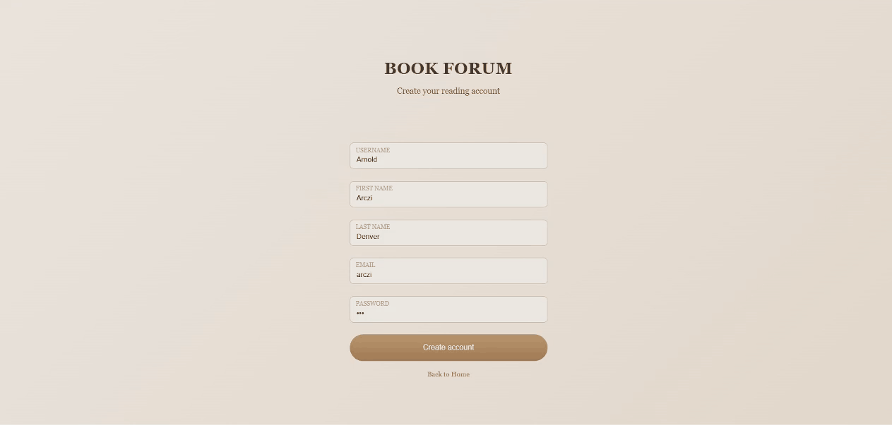
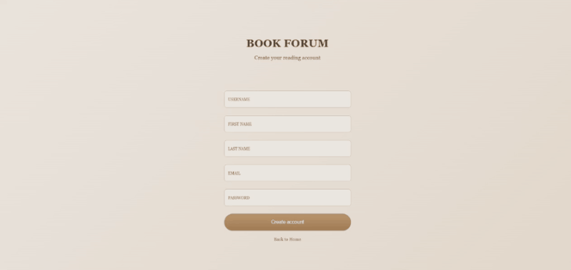
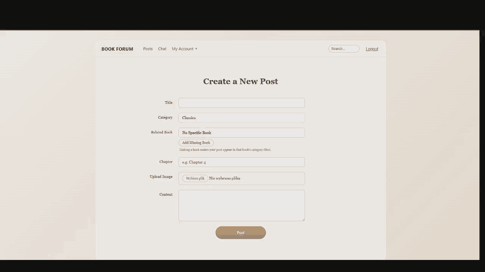
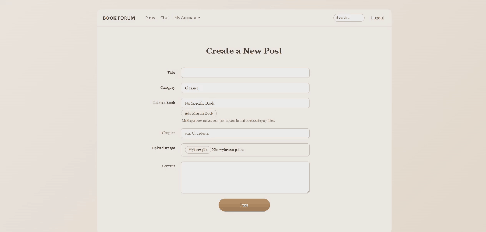
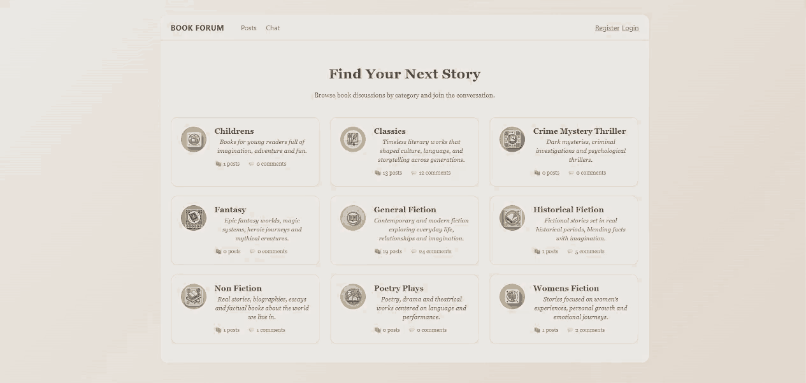

 
  

<picture>
  <source media="(prefers-color-scheme: dark)" srcset="github-contribution-grid-snake-dark.svg" />
  <source media="(prefers-color-scheme: light)" srcset="github-contribution-grid-snake.svg" />
  
</picture>

## Hey, I'm Aleksander 👋

Welcome to my GitHub!  I’m a student at Kood/Sisu 🎓, currently diving into the world of Go, HTML, CSS, JavaScript, and Git 💻. I’m passionate about learning, creating, and improving my coding skills every day 🚀  🌍 I speak English and Polish — and a bit of German and Finnish too ✨  Let’s build something awesome together! 💡

## 💻 Tech Stack

### 🧠 Languages:  -%23323330.svg?style=for-the-badge&logo=javascript&logoColor=%23F7DF1E)  

### 🎨 Front-end:    

### 🧩 Back-end:  

### 🛠 Tools:  

### 🧊 3D: 

### 🎓 Academic Background:      

## Projects

### 🌌 Solar System (Three.js)
Interactive 3D simulation of the Solar System built with Three.js.  
The project visualizes planets orbiting the Sun with correct relative motion, lighting, and scale-focused composition.  
It was created as a learning project to deepen my understanding of 3D graphics, scene management, camera control, textures, and real-time rendering in the browser.

**Tech:** Three.js, JavaScript (ES6), WebGL  
**Live demo:** https://kruczym.github.io/SolarSystem/

---

### 🖼 3D Art Exhibition (Virtual Gallery)
A browser-based 3D art gallery designed with performance in mind.  
The exhibition space is built using assets prepared in Blender, where lighting and shadows are baked directly into textures to significantly reduce runtime GPU and CPU load.  
This approach allows the gallery to run smoothly in the browser while preserving a consistent visual style, even on lower-end devices.

The project focuses on scene organization, asset optimization, efficient rendering, and intuitive user navigation rather than real-time physically accurate lighting.

**Tech:** Three.js, JavaScript, Blender, WebGL  
**Live demo:** https://kruczym.github.io/3D-project-art-exhibition/

---

### 🎮 Three.js Stack Game
A minimal 3D arcade-style stacking game built with Three.js.  
The goal is to stack moving blocks on top of each other as precisely as possible.  
With each successful placement, the difficulty increases until the player fails.

The project focuses on game logic, collision alignment, animation timing, and clean state management in a 3D environment.

**Tech:** Three.js, JavaScript, WebGL  
**Live demo:** https://kruczym.github.io/ThreeJs-stack-game/

---

### 🔒 Private Academic Projects
Some of my projects were developed as part of my studies at **Kood/Sisu** and are required to remain private according to the school’s rules.  
These include larger full-stack and system-level assignments that can be demonstrated or discussed upon request, but are not publicly available as repositories.

## 📚 Book Forum — Full-Stack Web Application (Private Academic Project)

A full-stack discussion forum for book lovers, developed as part of my studies at **Kood/Sisu**.  
The application allows users to create accounts, participate in discussions, create posts assigned to book categories, and interact with other users in real time.

---

### Authentication & User Accounts
Users can register and log in using a secure authentication flow with proper validation and error handling.

**Features:**
- User registration and login
- Form validation and user-friendly error messages
- Session-based authentication
- Access control for authenticated users

---

### Creating Posts
Authenticated users can create new discussion posts and assign them to book categories and related books.

**Features:**
- Create new posts with title, content, category, and optional related book
- File upload support (images)
- Server-side validation
- Clean and consistent UI flow

---

### Posts & Interactions
Users can browse posts, read discussions, and interact with content created by others.

**Features:**
- Category-based browsing
- Commenting system
- Like / interaction mechanisms
- Clear separation of posts and comments

---

### Real-Time Chat
The forum includes a real-time chat feature for direct user communication.

**Features:**
- Real-time messaging
- User presence awareness
- Integrated chat interface within the forum

---

### Technical Highlights
- Clean separation of concerns (handlers, models, templates)
- Relational database with enforced data integrity
- Secure session management
- Server-side rendering for reliability and performance
- Thoughtful UI/UX focused on readability and accessibility

**Tech stack:**  
Go · HTML · CSS · JavaScript · SQLite · Docker · Git

---

## Social

  
  
  

